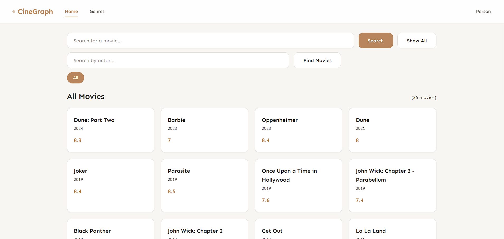
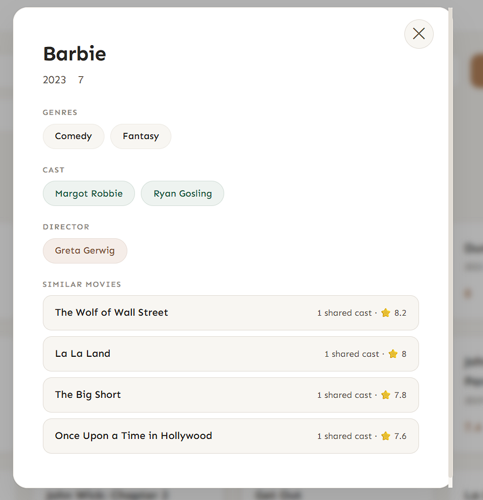
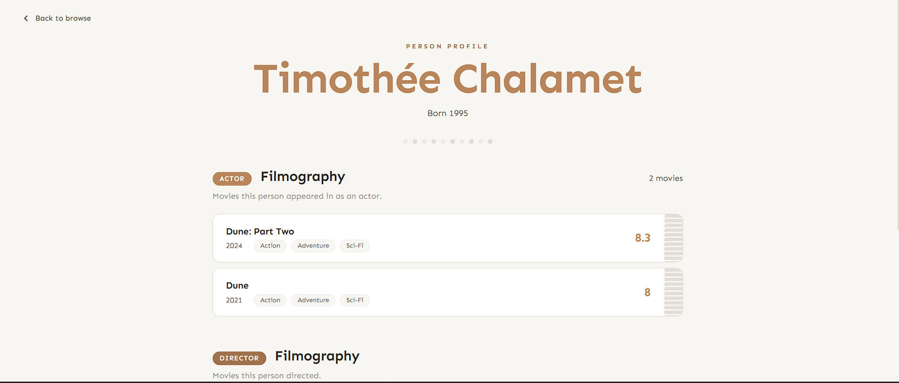
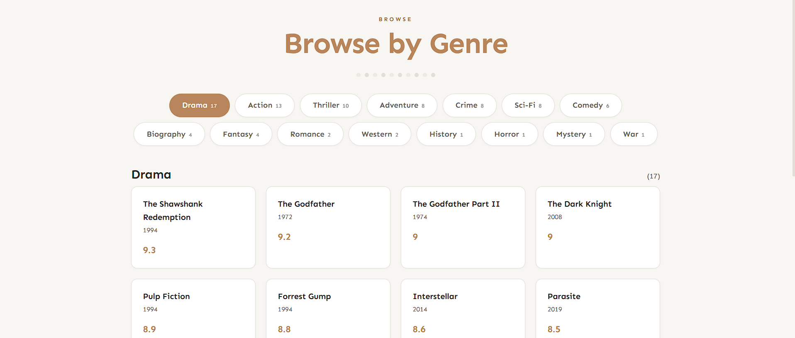

# CineGraph – Movie Explorer

A graph‑backed movie discovery platform built with **CognoDB** (managed Neo4j) and **Node.js + Express**.
Explore movies, actors, directors, and the connections between them — like who worked with whom, and which movies share cast members.

**Live demo:** https://movierec-pri1.onrender.com
> Note: hosted on Render's free tier — the first request after inactivity may take 30–60s to wake the server.

**Screen recording:** [demo.mp4](client/screenshots/demo.mp4)


---

## Why a graph database?

Movies, people, and genres are **naturally connected**.
In a relational database, finding "movies that share at least two actors with this one" would require multiple self‑joins on a `movie_cast` bridge table. As the number of relationships grows, SQL queries become complex, slow, and hard to maintain.

With a graph database (CognoDB / Neo4j):

- **Traversals are first‑class** – you simply follow relationships:
  `(Movie)<-[:ACTED_IN]-(Person)-[:ACTED_IN]->(otherMovie)`
- **No expensive joins** – the physical storage is optimised for graph walks.
- **Schema‑flexible** – you can add new relationship types (e.g., `PRODUCED_BY`) without changing tables.

This app demonstrates that advantage with real‑world data:
- Find an actor's entire filmography (including genres) in one 2‑hop traversal.
- Find the most frequent co‑stars with a simple `MATCH` pattern.
- Recommend similar movies based on shared cast members – a query that feels awkward in SQL but is natural in Cypher.
- Unify a person's acting **and** directing credits in a single profile – something that would require a `UNION` or complex joins in SQL.

---

## Data model diagram


**Nodes**
- `Movie {title, year, rating}`
- `Person {name, born}`
- `Genre {name}`

**Relationships**
- `(Person)-[:ACTED_IN]->(Movie)`
- `(Person)-[:DIRECTED]->(Movie)`
- `(Movie)-[:IN_GENRE]->(Genre)`

---

## Setup & Run (local development)

### 1. Create a CognoDB instance
1. Sign up at [console.cognodb.com/signup](https://console.cognodb.com/signup) — no credit card needed.
2. Create a free (c0) instance and pick a region. It provisions in under a minute.
3. Copy the connection URI (`bolt+s://<instance-id>.databases.cognodb.cloud`) and the generated password for user `cognodb` — the password is shown only once, so save it immediately.

### 2. Configure environment
Create a `.env` file inside `server/`:

```
NEO4J_URI=bolt+s://<your-instance-id>.databases.cognodb.cloud
NEO4J_USER=cognodb
NEO4J_PASSWORD=<your-password>
PORT=3000
```

> `.env` is git‑ignored — never commit real credentials.

### 3. Install dependencies & seed the database
```bash
cd server
npm install
node seed.js
```
This clears any existing data and creates 35 movies, 63 people, 15 genres, and all `ACTED_IN` / `DIRECTED` / `IN_GENRE` relationships between them.

You can verify the seed worked by running:
```bash
node schema-check.js
```
This prints node/relationship counts by type and a sample movie with its full set of connections.

### 4. Run the app
```bash
node server.js
```
Visit `http://localhost:3000` in your browser.

---

## Main queries explained

**Similar movies (2‑hop traversal)** — `GET /api/movies/:title/similar`
```cypher
MATCH (m:Movie {title: $title})<-[:ACTED_IN]-(a:Person)-[:ACTED_IN]->(other:Movie)
WHERE other.title <> $title
RETURN other.title AS title, other.rating AS rating, count(DISTINCT a) AS sharedCount
ORDER BY sharedCount DESC, other.rating DESC
LIMIT 5
```
Walks from a movie to its actors, then back out to every other movie those actors appeared in, counting shared cast members along the way. In SQL this needs a self‑join through a cast bridge table plus a `GROUP BY` — here it's a single readable pattern match.

**Frequent collaborators (2‑hop traversal)** — `GET /api/person/:name/collaborators`
```cypher
MATCH (p:Person)
WHERE toLower(p.name) = toLower($name)
MATCH (p)-[:ACTED_IN]->(m:Movie)<-[:ACTED_IN]-(other:Person)
WHERE other.name <> p.name
RETURN other.name AS name, count(DISTINCT m) AS sharedMovies
ORDER BY sharedMovies DESC
LIMIT 10
```
Finds every other actor who shares a movie credit with a given person, ranked by how often they've worked together — a natural "who has this person worked with most" question that's tedious to express relationally.

**Unified person profile (acting + directing in one call)** — `GET /api/person/:name`
Runs three queries against the same `Person` node — base info, acted‑in credits with genres, and directed credits with genres — and merges them into a single JSON response. Avoids a `UNION` across two different relationship types that a relational schema would otherwise need.

All queries above use parameterized inputs (`$title`, `$name`) via the official `neo4j-driver` — no string concatenation.

---

## Error handling

If the CognoDB connection is unreachable, API routes return a `500` with a JSON error message. The frontend (`index.html`, `person.html`, `genre.html`) catches failed fetches and shows a clear on‑page message (e.g. *"Could not connect to the database. Is the server running?"*) instead of a blank or broken page.

---

## Screenshots






## Tech stack

- **Database:** CognoDB (managed Neo4j, Bolt protocol) via the official `neo4j-driver`
- **Backend:** Node.js, Express
- **Frontend:** Vanilla HTML/CSS/JS (no build step), Google Fonts (Sen)